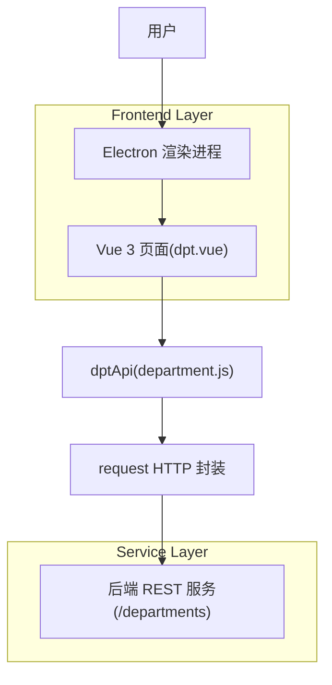

## 1.Architecture design

## 2.Technology Description
- Frontend: Vue@3（Composition API + script setup） + Naive UI + Vite
- Desktop Shell: Electron
- State: Pinia（用于菜单/Tab 等全局状态，部门页按需使用）
- HTTP: request 工具（封装 GET/POST/PUT/DELETE），通过 `dptApi` 统一调用
- Backend: 既有 HTTP 服务（本方案仅定义调用契约，不实现后端）

## 3.Route definitions
> 你的项目路由由后端菜单动态下发并通过 `import.meta.glob('../pages/**/*.vue')` 动态加载页面组件；部门管理页路径以菜单配置为准。

| Route | Purpose |
|-------|---------|
| （动态）菜单配置 path，例如 `/baseInfo/dpt` | 部门管理（分页查询、新增/编辑/删除/批量删除） |

补充：前端接口统一从 `@renderer/src/api/department.js` 导出的 `dptApi` 调用。
